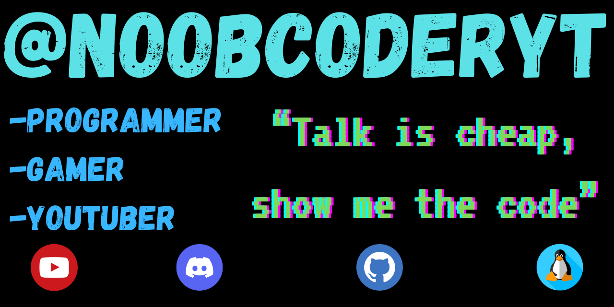

# Hi there, I'm NoobCoder! 👋

I'm a **YouTuber**, **Gamer**, **Programmer**, **Linux Enthusiast** and **Discord Server Owner**.

## 🤝 Connect with me:

## 🛠️ Skills:

## 📊 GitHub Stats:

## 🚀 Best Projects:

- [Lunix](https://github.com/noobcoderyt/Lunix) - The Official Discord bot for TheLinuxHideout!
- [LearnLinuxCom](https://noobcoderyt.github.io/LearnLinuxCom/) - Linux for Beginners!

> "Talk is cheap, show me the Code" - Linus Torvalds
